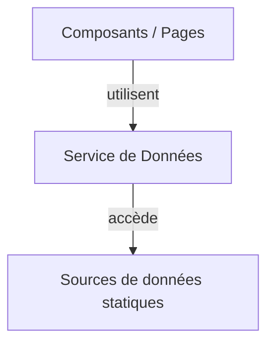

# Impact IA sur les ESN - Dashboard


## À propos du projet

Ce dashboard interactif visualise l'impact de l'Intelligence Artificielle (IA) générative et agentique sur les métiers des Entreprises de Services Numériques (ESN) et l'évolution nécessaire de leur modèle d'affaires.

<p align="center">
  
</p>

## Fonctionnalités principales

- **Analyse des transformations des métiers** : Impact détaillé de l'IA sur les développeurs, business analysts, architectes et testeurs
- **Benchmarks économiques** : Comparaison des stratégies des ESN leaders (Capgemini, Accenture, Sopra Steria)
- **Stratégies d'adaptation** : Feuille de route pour transformer le modèle d'affaires des ESN
- **Sources et méthodologie** : Documentation complète des sources utilisées et de l'approche d'analyse
- **Comparaison de productivité** : Démonstration de l'impact de l'IA sur le développement logiciel, à travers la création même de cette application

## Démarrage rapide

### Prérequis

- Node.js (v14.0.0 ou supérieur)
- npm (v6.0.0 ou supérieur) ou yarn

### Installation

```bash
# Cloner le dépôt
git clone https://github.com/kbekouchi/impact-ia-esn-dashboard.git

# Naviguer vers le répertoire
cd impact-ia-esn-dashboard

# Installer les dépendances
npm install
# ou
yarn install

# Démarrer l'application
npm start
# ou
yarn start
```

Consultez notre [Guide d'installation](./INSTALLATION.md) pour des instructions plus détaillées.

## Documentation

Une documentation complète est disponible :

- [Documentation générale](./DOCUMENTATION.md) - Architecture, fonctionnalités et données
- [Guide d'installation](./INSTALLATION.md) - Instructions détaillées pour l'installation et le déploiement
- [Guide de contribution](./CONTRIBUTING.md) - Comment contribuer au projet
- [Service de données](./docs/data-service.md) - Documentation sur l'accès aux données
- [Guide du développeur](./docs/developer-guide.md) - Bonnes pratiques et conventions de code

## Captures d'écran

<div align="center">
  
  
  
  
</div>

## Technologies utilisées

- **Frontend** : React, React Router, Recharts
- **Styling** : Tailwind CSS
- **Outils de développement** : Create React App, ESLint

## Architecture des données

L'application utilise une architecture de service de données centralisée pour gérer l'accès aux données. Cette approche facilite la maintenance et l'évolution vers des sources de données dynamiques.



### Avantages
- Découplage entre les composants d'interface et les sources de données
- Point d'accès unique et standardisé aux données
- Facilité de transition vers d'autres sources de données dans le futur

Consultez la [documentation du service de données](./docs/data-service.md) pour plus de détails.

## Structure du projet

```
impact-ia-esn-dashboard/
├── docs/                    # Documentation technique détaillée
├── public/                  # Ressources statiques
├── src/                     # Code source
│   ├── components/          # Composants réutilisables
│   ├── data/                # Données et sources
│   ├── pages/               # Pages principales
│   ├── services/            # Services d'application (dont le service de données)
│   ├── App.js               # Composant racine
│   └── index.js             # Point d'entrée
└── ...                      # Autres fichiers de configuration
```

## Roadmap

- [x] Phase 1: Centralisation des données statiques
- [ ] Phase 2: Chargement de fichiers JSON externes
- [ ] Phase 3: Implémentation d'une API simple
- [ ] Phase 4: Interface d'administration simple
- [ ] Ajout d'un module de simulation personnalisée
- [ ] Support multilingue
- [ ] Version mobile optimisée
- [ ] Mode hors ligne

## Contribution

Les contributions sont les bienvenues ! Consultez notre [Guide de contribution](./CONTRIBUTING.md) pour commencer.

## Licence

Ce projet est sous licence MIT. Voir le fichier [LICENSE](./LICENSE) pour plus de détails.

## Contact

Pour toute question ou suggestion, n'hésitez pas à ouvrir une issue sur ce dépôt.

## Remerciements

- [McKinsey](https://www.mckinsey.com/) - Pour leurs études sur l'IA générative
- [Gartner](https://www.gartner.com/) - Pour leurs analyses des tendances IT
- [World Economic Forum](https://www.weforum.org/) - Pour le Future of Jobs Report
- [GitHub](https://github.blog/) - Pour leurs études sur la productivité des développeurs
